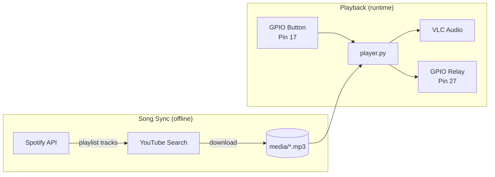

# Bathroom Music Button 🚽🎵

[](https://github.com/momonala/bathroom-media/actions/workflows/ci.yml)
[](https://codecov.io/gh/momonala/bathroom-media)

A hacker's way to listen to music in the toilet. 

Sometimes you want music in the bathroom but don't want to deal a phone, Bluetooth, decisions. You just wnat vibes. This overengineered solution plays a random song from a Spotify-synced playlist whenever you press a physical button.

---

## Tech Stack

`Python 3.12` · `VLC (python-vlc)` · `Raspberry Pi GPIO` · `Spotify API` · `YouTube (yt-dlp)` · `uv`

---

## Architecture



**Data Flow:**
1. `src/download_songs.py`: Fetches playlist from Spotify → searches YouTube → downloads as MP3
2. `src/player.py`: Waits for button press → picks random MP3 → plays via VLC → controls relay

---

## Prerequisites

- Raspberry Pi (any model with GPIO)
- Python 3.12+
- VLC media player (`sudo apt install vlc`)
- ffmpeg (`sudo apt install ffmpeg`)
- Spotify Developer Account (free) for API credentials
- uv (Python package manager - installed automatically by install script)

**Hardware:**

| Component | GPIO Pin (BCM) |
|-----------|----------------|
| Push Button | 17 |
| Relay Module | 27 |

---

## Installation

### 1. Clone and install dependencies

```bash
git clone <repo-url>
cd bathroom-media

# Using the install script (sets up uv + systemd)
./install/install.sh

# Or manually with uv
uv sync
```

### 2. Configure Spotify credentials

Create `src/values.py`:

```python
SPOTIFY_CLIENT_ID: str = "your_client_id"         # Required - from Spotify Developer Dashboard
SPOTIFY_CLIENT_SECRET: str = "your_client_secret" # Required - from Spotify Developer Dashboard
PLAYLIST_URI: str = "your_playlist_id"            # Required - the ID from your playlist URL
```

> Get credentials at https://developer.spotify.com/dashboard

### 3. Download songs

```bash
python src/download_songs.py
```

This syncs your Spotify playlist locally. Songs removed from the playlist are deleted from cache.

### 4. Wire hardware

- Button → GPIO 17 (uses internal pull-up resistor)
- Relay → GPIO 27 (HIGH = on during playback)
- Speaker → Pi audio output

---

## Running

```bash
python src/player.py
```

Press the button to play a random song. Press again during playback to skip.

**Volume behavior:** 80% during daytime (9am–10pm), 50% at night.

---

## Project Structure

```
bathroom-media/
├── src/
│   ├── player.py           # Main entry point - GPIO button handler + VLC playback
│   ├── download_songs.py   # Syncs Spotify playlist → YouTube → local MP3s
│   ├── spotify_search.py   # Spotify API client - fetches playlist tracks
│   ├── youtube_search.py   # YouTube search + yt-dlp download
│   └── values.py           # Credentials (gitignored) - MUST CREATE
├── media/                  # Downloaded MP3 cache (gitignored)
├── pyproject.toml          # Project dependencies (PEP 621)
├── requirements.txt        # Pip fallback
├── install/
│   ├── install.sh                        # Full setup script (uv + systemd)
│   ├── projects_bathroom-button.service  # systemd unit file
│   ├── mosquitto.conf                    # MQTT broker config (optional)
│   └── mqtt.service                      # MQTT systemd unit (optional)
├── esp_mqtt_button/
│   └── esp_mqtt_button.ino  # Arduino sketch for wireless ESP8266 button
└── tests/
    └── test_nothing.py      # Test suite
```

---

## Key Concepts

| Concept | Description |
|---------|-------------|
| `media/` cache | MP3s stored as `{track}{artist}.mp3` (no spaces/punctuation). Sync deletes removed songs. |
| Relay control | GPIO 27 goes HIGH during playback, LOW when stopped. Use for LED indicator or amp power. |
| Volume schedule | Auto volume: 80% daytime (9am–10pm), 50% at night. Based on system time. |
| Button debounce | Uses GPIO internal pull-up. Polling-based detection in main loop. |
| Song selection | Random choice from `media/*.mp3` on each button press. |

---

## Storage

| Path | Purpose |
|------|---------|
| `media/*.mp3` | Cached songs from Spotify playlist |
| `src/values.py` | Spotify API credentials (gitignored) |

---

## Deployment (systemd)

The install script handles this, but manually:

```bash
# Copy service file
sudo cp install/projects_bathroom-button.service /lib/systemd/system/

# Enable and start
sudo systemctl daemon-reload
sudo systemctl enable projects_bathroom-button.service
sudo systemctl start projects_bathroom-button.service

# View logs
journalctl -u projects_bathroom-button.service -f
```

---

## Deprecated: Wireless Button (ESP8266 + MQTT)

An older version used ESP8266 + MQTT for wireless button triggering. This is deprecated in favor of direct GPIO. See [`README.mqtt.md`](README.mqtt.md) for historical reference.

---

## Troubleshooting

| Issue | Fix |
|-------|-----|
| No audio | Check `aplay -l` for devices. VLC config: `--alsa-audio-device=hw:0,0` |
| GPIO permission denied | Run with `sudo` or add user to `gpio` group |
| Spotify auth fails | Verify `src/values.py` credentials match your Spotify Developer app |
| Songs not downloading | Ensure ffmpeg installed. Update yt-dlp: `pip install -U yt-dlp` |
| Download hangs | YouTube search rate limits. `POOL_SIZE=2` in `src/download_songs.py` controls parallelism. |

---

## License

MIT — do whatever you want. just don't blame me when your bathroom catches fire.
